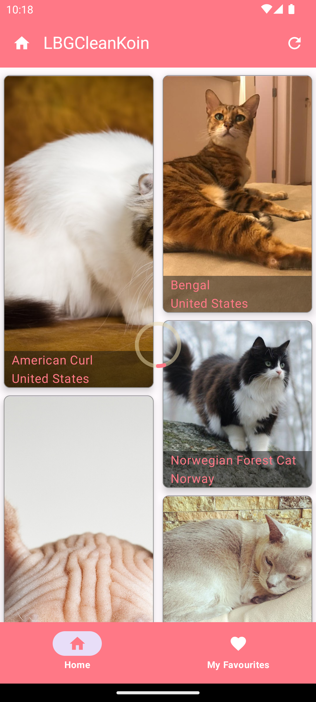
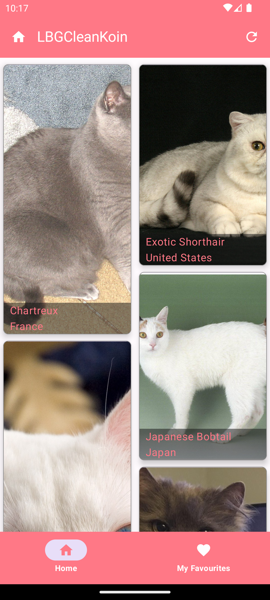
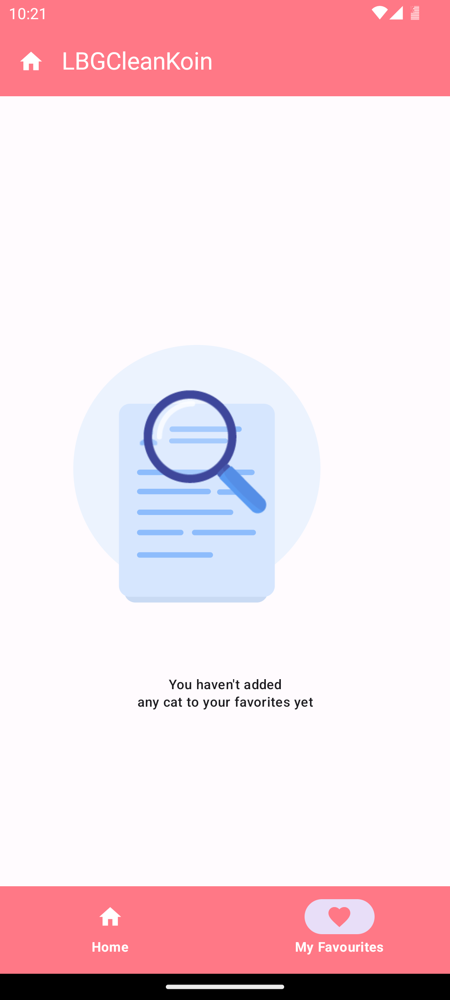
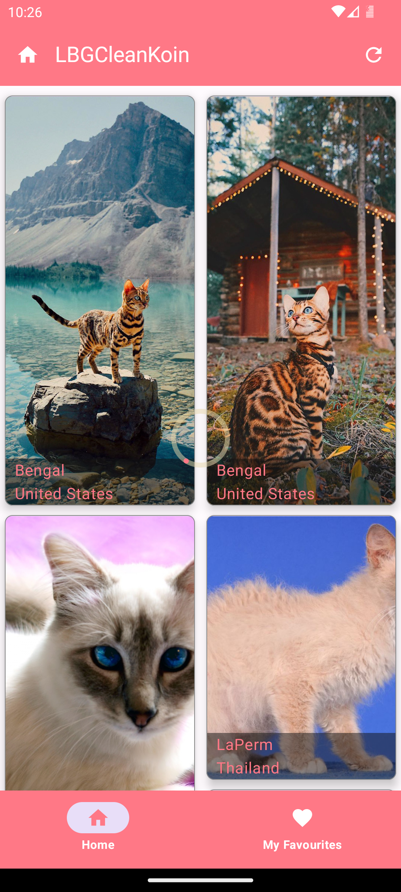
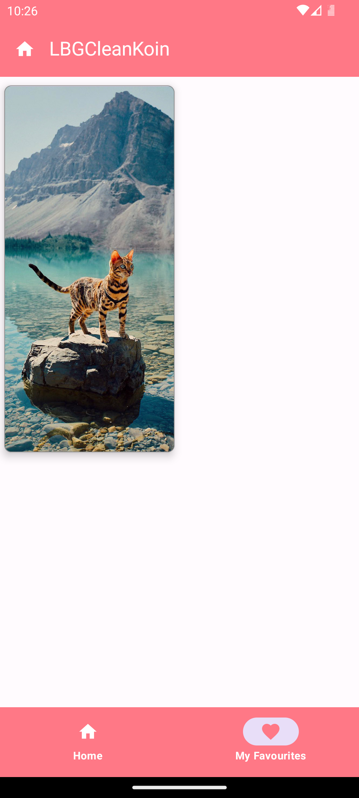
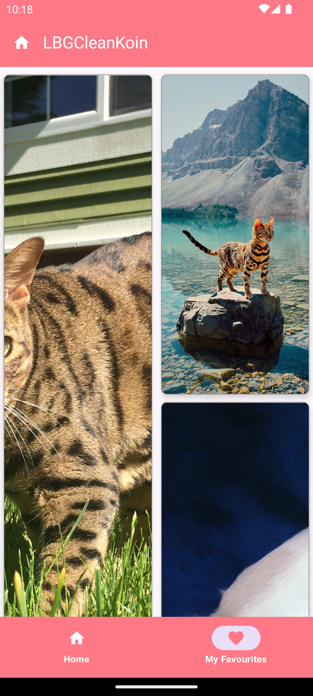

<br />
  <a href="https://github.com/othneildrew/Best-README-Template">
  
  <h2 align="start">Kotlin MVVM-Clean Architect-JetPack Compose-Example-with- DI-Koin, Coroutines, Retrofit, Room, Solid Principles, DRY Principle, OOPs</h2>

[](https://opensource.org/licenses/Apache-2.0)

[](https://developer.android.com/jetpack/compose)
[](https://insert-koin.io/)
[](http://kotlinlang.org)
[](https://developer.android.com/training/data-storage/room)
[](https://lv.binarybabel.org/catalog/gradle/latest)
[](https://lv.binarybabel.org/catalog/gradle/latest)
[](https://lv.binarybabel.org/catalog/gradle/latest)

<p align="start">










## Table of Contents

* [About the Project](#about-the-project)
* [Architecture](#architecture)
* [Tech stack](#tech-stacks)
* [Features](#features)
* [Unit Testing](#unit-testing)
* [Environment Setup](#environment-setup)
* [Commits Includes](#commits-includes)

# About the Project

Kotlin MVVM-Clean Architect-JetPack Compose-Example-with- DI-Koin is a sample project that presents
a modern approach to Android app development.
The project tries to combine popular Android tools and to demonstrate best development practices by
utilizing up to date tech-stack like Compose, Kotlin Flow and Koin.
The sample app layers its presentation through MVVM Clean Architecture presentation pattern.

## Architecture

* Modern Architecture
  * Single activity architecture (
  with [Navigation component](https://developer.android.com/guide/navigation/navigation-getting-started))
  that defines navigation graphs
  * [MVVM Clean Architecture](https://medium.com/@ami0275/mvvm-clean-architecture-pattern-in-android-with-use-cases-eff7edc2ef76)
  -A reactive and layered architecture.
  * [Android Architecture components](https://developer.android.com/topic/libraries/architecture) ([ViewModel](https://developer.android.com/topic/libraries/architecture/viewmodel), [Navigation](https://developer.android.com/jetpack/androidx/releases/navigation))
  * [Android KTX](https://developer.android.com/kotlin/ktx) - Jetpack Kotlin extensions
* UI
  * [Compose](https://developer.android.com/jetpack/compose) declarative UI framework
  * [Material design](https://material.io/design)

## Why do we need an architecture even when you can make an app without it?

Imagine you've initiated a project without a well-defined architecture, handling all aspects within
the Activity class. This means everything from making API calls, interacting with the database, to
parsing data is being done in one place. Even if you've created separate classes for these tasks,
your Activity class ends up becoming a "god object," responsible for an array of functionalities.

Now, your app is live, and users are actively using it. Suddenly, a new requirement emerges, such as
a need for UI changes. However, your Activity class has become tightly coupled to various functions
like data parsing, API communication, and database interactions. This tight coupling makes altering
the UI a time-consuming and error-prone task. There's a risk of introducing new bugs while making
these changes, and maintaining the codebase becomes challenging.

In essence, without a proper architecture in place, your codebase becomes hard to manage, tracking
down and resolving bugs becomes a daunting task, and reusability of the Activity class is
compromised. Changes to the UI end up inadvertently affecting other functionalities, creating a
maintenance headache.
This is where a well-thought-out architectural approach comes to the rescue.

## Architectue

An architecture is the backbone that empowers your project to be robust, extensible, maintainable,
scalable, reusable, and testable through unit testing. It serves as the organizational structure for
your system, encompassing the decomposition of complex problems or systems into smaller, manageable
parts, their interconnections, interaction protocols, and the fundamental principles and design
choices governing the system's construction. This architectural framework minimizes chaos.
With a well-defined architecture in place, you gain the capability to seamlessly introduce new
features, implement changes, write comprehensive unit test cases, ensure ease of maintenance, and
promote code reusability. In essence, architecture provides the solid foundation that makes these
aspects attainable and manageable.

## How?

It adheres to a set of fundamental principles collectively known as SOLID. These design principles
are techniques employed in the process of designing and writing code, with the aim of enhancing code
maintainability, flexibility, and extensibility.

#### SOLID is an acronym for five design principles that help create maintainable and scalable software:

- Single Responsibility Principle (SRP): A class should have only one reason to change.
- Open-Closed Principle (OCP): Software entities (classes, modules, functions, etc.) should be open
  for extension but closed for modification.
- Liskov Substitution Principle (LSP): Subtypes must be substitutable for their base types without
  altering the correctness of the program.
- Interface Segregation Principle (ISP): Clients should not be forced to depend on interfaces they
  do not use.
- Dependency Inversion Principle (DIP): High-level modules should not depend on low-level modules.
  Both should depend on abstractions.

[MVVM (Model-View-ViewModel) Clean architecture](https://medium.com/@ami0275/mvvm-clean-architecture-pattern-in-android-with-use-cases-eff7edc2ef76)
pattern has been used in the development of this application. The development language of the
application is Kotlin. Clean Architecture is a design approach that separates concerns, promoting
maintainability and testability. Combining MVVM with Clean Architecture helps organize an Android
app into layers like

* Presentation Layer
* Domain Layer
* Data Layer


which making it easier to develop and test.

* Architecture;
  *    [ViewModel](https://developer.android.com/topic/libraries/architecture/viewmodel)
  *    [Koin](https://insert-koin.io/docs/quickstart/android/)
  *    [Navigation](https://developer.android.com/guide/navigation)

## Tech Stacks

- [Kotlin](https://kotlinlang.org/) 100% coverage

- [Compose](https://developer.android.com/jetpack/compose)
  - [Material](https://developer.android.com/jetpack/androidx/releases/compose-material) - Build
  Jetpack Compose UIs with ready to use Material Design Components.
  - [Foundation](https://developer.android.com/jetpack/androidx/releases/compose-foundation) - Write
  Jetpack Compose applications with ready to use building blocks and extend foundation to build your
  own design system pieces.
  - [UI](https://developer.android.com/jetpack/androidx/releases/compose-ui) - Fundamental
  components of compose UI needed to interact with the device, including layout, drawing, and input.
  - [ConstraintLayout](https://developer.android.com/jetpack/androidx/releases/constraintlayout) -
  ConstraintLayout-compose 1.0 provides ConstraintLayout functionalities in Jetpack Compose.
  - [Lifecycle-ViewModel](https://developer.android.com/jetpack/androidx/releases/lifecycle) -
  Perform actions in response to a change in the lifecycle status of another component, such as
  activities and fragments.
  - [Lottie](https://github.com/airbnb/lottie/blob/master/android-compose.md) - Lottie is a mobile
  library for Android and iOS that parses Adobe After Effects animations exported as json with
  Bodymovin and renders them natively on mobile!
    - [Glide](https://bumptech.github.io/glide/int/compose.html) - A fast and efficient image
      loading library for Android focused on smooth scrolling (Google).

- Dependency Injection (DI)
    - [Koin](https://insert-koin.io/docs/quickstart/android/) -Koin provides a easy and efficient
      way to incorporate dependency injection into any Kotlin application.In this project i am using
      Koin but you can
      use [Hilt](https://developer.android.com/training/dependency-injection/hilt-android) and
      Dragger for the same.

- [Jetpack](https://developer.android.com/jetpack)
    - [AndroidX](https://developer.android.com/jetpack/androidx) - Major improvement to the original
      Android [Support Library](https://developer.android.com/topic/libraries/support-library/index),
      which is no longer maintained.
    - [Lifecycle](https://developer.android.com/topic/libraries/architecture/lifecycle) - Perform
      actions in response to a change in the lifecycle status of another component, such as
      activities and fragments.
    - [ViewModel](https://developer.android.com/topic/libraries/architecture/viewmodel) - Designed
      to store and manage UI-related data in a lifecycle conscious way. The ViewModel class allows
      data to survive configuration changes such as screen rotations.
    - [Room](https://developer.android.com/training/data-storage/room) - Provides an abstraction
      layer over SQLite used for offline data caching.
    - [Navigation](https://developer.android.com/guide/navigation) -Navigation refers to the
      interactions that let users navigate across, into, and back out from the different pieces of
      content within your app.

- Others
  -    [Retrofit](https://square.github.io/retrofit/)  for networking
  -    [OkHttp-Logging-Interceptor](https://github.com/square/okhttp/blob/master/okhttp-logging-interceptor/README.md)  -
  Logs HTTP request and response data.
  -    [Flow](https://developer.android.com/kotlin/flow) - Flows are built on top of coroutines and
  can provide multiple values.
  - [Material Design](https://material.io/develop/android/docs/getting-started/) - Build awesome
  beautiful UIs.
  - [Coroutines](https://github.com/Kotlin/kotlinx.coroutines) - Library Support for
  coroutines,provides runBlocking coroutine builder used in tests.
  - [Gson](https://github.com/google/gson) - A modern JSON library for Kotlin and Java.

- Functions
  - <details><summary><a href="https://kotlinlang.org/docs/scope-functions.html"><b>Scope Functions</b></a></summary><blockquote>
      <details><summary><a href="https://github.com/P-C-Data/LBG-MVVM-Clean-Koin/blob/de33b31631dbdb8434f1cf7913bf4b31faa2b1fc/app/src/main/java/com/clean/lbg/presentation/ui/features/cats/view/CatsScreen.kt#L331C27-L337C34"><b>let</b></a> </summary><blockquote>
           it is used for executing a block of code on a non-null object.
        The result of the block is the return value of the let expression.
        
    ```js
      	 val result = "Hello, Kotlin!".let {
		 println(it)
		 it.length
		 }
		 // Output: Hello, Kotlin!
		 // result: 13
      ```
    </blockquote>
    </details>
    
    <details><summary><a href="https://github.com/P-C-Data/LBG-MVVM-Clean-Koin/blob/de33b31631dbdb8434f1cf7913bf4b31faa2b1fc/app/src/main/java/com/clean/lbg/domain/usecase/cats/GetCatsUseCaseImpl.kt#L13C1-L22C10"><b>with </b></a></summary> <blockquote>
          It is used to call multiple methods on the same object without repeating the object reference.
          It does not operate on the context object.

    ```js
            val result = with("Hello, Kotlin!") {
            println(this)
            length
            }
           // Output: Hello, Kotlin!
          // result: 13
    ```
    </blockquote>  
    </details>
    
    <details><summary><a href="https://github.com/P-C-Data/LBG-MVVM-Clean-Koin/blob/de33b31631dbdb8434f1cf7913bf4b31faa2b1fc/app/src/main/java/com/clean/lbg/data/database/LBGDatabase.kt#L25C14-L26C34"><b>also </b></a></summary> <blockquote>
          It is used for additional operations  on the object.
          The return value is the original object.
      
    ```js 	
           val result = "Hello, Kotlin!".also {
        println("Original: $it")
        it.toUpperCase()
      }
      // Output: Original: Hello, Kotlin!
      // result: Hello, Kotlin!
    ```
    </blockquote>  
    </details>
    <details><summary><b>run  </b></summary> <blockquote>
          It is similar to let but operates on the context object itself.
          The result of the block is the return value of the run expression.
      
    ```js
           val result = "Hello, Kotlin!".run {
            println(this)
            this.length
          }
        // Output: Hello, Kotlin!
        // result: 13
    ```
    </blockquote>  
    </details>
    
    <details><summary><a href="https://github.com/P-C-Data/LBG-MVVM-Clean-Koin/blob/de33b31631dbdb8434f1cf7913bf4b31faa2b1fc/app/src/main/java/com/clean/lbg/presentation/ui/features/cats/CatsActivity.kt#L49C22-L55C22"><b>apply</b></a></summary> <blockquote>
        It is used to initialize an object or apply operations on an object.
        The result is the context object itself.
       
    ```js
           val result = StringBuilder().apply {
           append("Hello, ")
           append("Kotlin!")
         }.toString()
         // result: Hello, Kotlin!
		```
    <blockquote>
    </details>
  </blockquote>
  </details>
  
  - <details><summary><a href="https://kotlinlang.org/docs/inline-functions.html"><b>Inline Function</b></a></summary><blockquote>
         It is used to inline the function body at the call site, which can improve performance in certain scenarios.
  
      ```js
          inline fun <reified T> inlineExample(value: T): String {
          return "Value: $value, Type: ${T::class.simpleName}"
          }

          val result = inlineExample(42)
          // result: Value: 42, Type: Int
       ```
        
  </blockquote>
  </details>
  
  - <details><summary><a href="https://www.geeksforgeeks.org/kotlin-higher-order-functions/"><b>High Order Function</b></a></summary><blockquote>
         It is a function that takes another function as a parameter or returns a function.
  
     ```js
          // Higher order function example: Calculator
          fun calculate(x: Int, y: Int, operation: (Int, Int) -> Int): Int {
          return operation(x, y)
          }
          fun add(x: Int, y: Int): Int {
          return x + y
          }
          fun subtract(x: Int, y: Int): Int {
          return x - y
          }
          fun multiply(x: Int, y: Int): Int {
          return x * y
          }
        fun main() {
        val result1 = calculate(10, 5, ::add)
        println("Addition: $result1") // Output: Addition: 15
        val result2 = calculate(10, 5, ::subtract)
        println("Subtraction: $result2") // Output: Subtraction: 5
        val result3 = calculate(10, 5, ::multiply)
        println("Multiplication: $result3") // Output: Multiplication: 50
        }
      ```
   </blockquote>
   </details>
     
  - <details><summary><a href="https://www.geeksforgeeks.org/kotlin-infix-function-notation/"><b>infix Function</b></a></summary><blockquote>
         It is used to inline the function body at the call site, which can improve performance in certain scenarios.
   
    ```js
          infix fun String.addExtension(extension: String): String {
          return "$this.$extension"
          }

        val result = "file" addExtension "txt"
        // result: file.txt
     ```
  </blockquote>
  </details>

  
# Features

- Save Favorite Cats: Users have the ability to save their favorite cat images by marking them as
  favorites.
- View Favorite Cats: Users can access a collection of all their saved favorite cat images in one
  place.
- Discover Random Cat Images: The application presents users with random cat images when they open
  it. Users can also view these images in full-screen mode by tapping on any image.
- Add to Favorites: Users can add any cat image to their list of favorites by clicking on a
  heart-shaped button associated with each image.
- Change App Theme: Users have the option to customize the application's visual theme to their
  preference. This includes options for light and dark themes or other theme customizations.

##### *Note*

In this example, I initially used two activities to display cats to the user and manage adding or
deleting cats from the favorite list. However, it's possible to achieve the same functionality
within
a single activity by implementing a navigation scenario for a fullView Composable, jetpack
Navigation, you can follow these steps:

1. Set Up Jetpack Navigation:

```kotlin 
 object Route {
        const val CAT_FULL_View = "Cat_Image_AS_Sized/{CatUrl}/{imageId}"
}
```

replace CatAvtivity current composable method

```kotlin 
@Composable
    fun CatsDestination() {
        CatScreen(
            state = viewModel.state.collectAsState().value,
            effectFlow = viewModel.effects.receiveAsFlow()
        ) { itemUrl, imageId ->
           
               // call navigate logic here 
                      // Navigate to the full view with the selected cat data
                            navController.navigate("catFullView/$itemUrl/$imageId")
        }
    }
```

then pass this route to navigation host case like

```kotlin 
composable(route=Route.CAT_FULL_View,
arguments = listOf(navArgument("itemUrl") { type = NavType.StringType },
                   navArgument("imageId") { type = NavType.StringType }
                    )
) {backStackEntry ->
                //call relevent compose method here to display full vie to user 
                    val catImageId = backStackEntry.arguments?.getString("imageId")
                      viewModel.checkFav(catImageId)
                    val catImageUrl = backStackEntry.arguments?.getString("itemUrl")
                       CatsFullView(catImageUrl)
                       

            }

```

2. Migrate All Api calls from CatsDetailsViewModel to CatsViewModel .After that you will only have
   one ViewModel present in Application.
3. Now you have to make changes in your composable to display fullView

```kotlin
 @Composable
    private fun CatsFullView(url:String) {
        val isFavourite by viewModel.isFavourite.collectAsState()
        initialState = remember { viewModel.isFavourite.value }
        CatFullDetail(
            url = url,
            isFavourite = isFavourite,
            favSelection = {
                viewModel.updateFavouriteState(it)
                if (it) {
                    viewModel.postFavCatData()
                } else viewModel.deleteFavCatData()
            }
        )

    }
```

4. According to above calls make changes in CatFullScreen.kt file
5. Replace topbar navigation icon to back icon when you saw user full view screen and handled this
   according to back flow.
For reference [lick haere](https://github.com/P-C-Data/LBG-MVVM-Clean-Koin-SingleActivity)

🙌 Now after that we have two ways to show same flow to user✌️.

<details><summary><a href="https://github.com/P-C-Data/LBG-MVVM-Clean-Koin"><b>1.Mutiple activity architechture</b></a></summary><blockquote>
While the trend in modern Android development often leans toward a single activity architecture using fragments and the Navigation Component, there are still scenarios where separate activities might make more sense. Here are some use cases where multiple activities could be considered:

<b>Independent Modules or Features:</b>
If different sections or modules of your app are largely independent and don't share UI components or complex interactions, using separate activities can provide clear separation between these modules.
Each activity can represent a distinct feature or functionality, making it easier to understand and maintain.

<b>Different Task Affinities:</b>
Activities with different task affinities can run in separate tasks, allowing them to exist independently in the task stack. This can be useful for certain workflows, such as having a separate authentication task.

<b>Deep Linking:</b>
If your app heavily relies on deep linking and you want to handle different deep links with distinct activities, separating them can be a clean way to organize deep linking logic.

<b>Task and Document-Centric Apps:</b>
Certain apps, such as document editors or task-centric apps, might benefit from separate activities. Each activity can represent a different document or task, providing a clear separation of contexts.

<b>Legacy Codebase:</b>
In some cases, you might be working with a legacy codebase that was designed around the multiple activity architecture. Converting to a single activity might not be feasible or might require significant refactoring.

<b>Performance Considerations:</b>
In specific performance-critical scenarios, having a minimalistic activity with a focused set of functionalities might be more efficient than hosting everything in a single activity.

<b>Platform Limitations:</b>
Some platform features or third-party libraries might work more seamlessly with multiple activities. Adhering to these requirements could influence the architecture choice.

It's important to note that even in these cases, the use of fragments and the Navigation Component can still be employed within each activity to manage the UI components and navigation within that specific context. The decision between single and multiple activities depends on various factors, including the app's structure, navigation requirements, user experience goals, and the team's preferences and expertise.

</blockquote>
</details>

<details><summary><a href="https://github.com/P-C-Data/LBG-MVVM-Clean-Koin-SingleActivity"><b>2.SingleActivity Architecture</b></summary><blockquote>
The preference for a single activity architecture over multiple activities in Android development has become more common in recent years. Here are some reasons why single activity architecture is often preferred:

<b>Navigation Component:</b> With the introduction of the Navigation Component in Android, it became easier to manage navigation between different screens or destinations within a single activity. The Navigation Component simplifies the implementation of navigation graphs and provides a more standardized way of handling navigation.

<b>Fragment Navigation:</b> Single activity architecture aligns well with the use of Fragments for UI components. Fragments can be used to represent different screens or sections of the app, and the single activity can host and manage these fragments.

<b>Lifecycle Management:</b> A single activity architecture simplifies the lifecycle management of the application. With only one activity, it's easier to handle the lifecycle events and avoid issues related to managing multiple activity lifecycles.

<b>Resource Efficiency:</b> Creating and destroying activities can be resource-intensive. With a single activity, you reduce the overhead associated with starting and stopping multiple activities, leading to a more efficient use of system resources.

<b>Consistent UI and Theming:</b> A single activity can provide a consistent UI and theming across the entire application. This can result in a more cohesive user experience, as the UI elements and styling remain consistent throughout the app.

<b>Easier Communication:</b> Communicating between fragments within the same activity is simpler compared to communicating between different activities. Fragments within the same activity share the same lifecycle, making it easier to pass data and events between them.

<b>Simplified Back Stack:</b> The back stack management is often simpler with a single activity architecture. The Navigation Component provides a back stack that is easier to manage and understand compared to managing multiple activity back stacks.

<b>Transition Animations:</b> Transition animations between fragments are smoother when they are hosted within the same activity. This can lead to a more polished and seamless user experience.

While single activity architecture has its advantages,'again' it's essential to note that the choice between single or multiple activities depends on the specific requirements of the app and the preferences of the development team. Some apps may still benefit from a multiple activity architecture, especially if they have distinct and independent sections that don't share UI components or if there are specific use cases where separate activities make more sense.

</blockquote>
</details>

# Koin Module Enhancements for Improved Scalability

This section details optimizations implemented in the project's Koin dependency injection setup, particularly in the declaration of Koin use case modules. These refinements enhance the flexibility and modularity of use case injection throughout the application.

Previous Koin Module Declaration:

In earlier project iterations, the Koin use case module was likely defined using the single scope:

```Kotlin
single { GetCatsUseCase(get()) }
```

While the single scope creates a singleton object persistent across the container's lifetime, this approach might not always align with optimal dependency management practices.

Addressing Lifetime Considerations:

The ideal scope for a dependency depends on its usage pattern:
```
**Long-lived components:** Services, data repositories, components used by multiple screens and should never be dropped.
**Medium-lived components:** User sessions, used by multiple screens but can be dropped after a specific period.
**Short-lived components:** Views, used by a single screen and dropped at the screen's end.
```

*Introducing Scalable Scoping:*

Recent project changes introduce factory and scoped definitions to cater to diverse dependency lifetimes:

**factory definition:** Creates a new object each time it's requested, suitable for short-lived, non-persistent dependencies.
```Kotlin
factory<GetCatsUseCase> { GetCatsUseCaseImpl(get()) }
```

**scoped definition:** Creates an object with persistence tied to an associated scope's lifetime. This fosters granular control over dependencies and contributes to improved application maintainability.
Scoped Dependency Injection in Action:

```Kotlin
scope(named("myScope")) {
  // Define dependencies specific to this scope (e.g., CatUseCase)
  scoped<CatUseCase> { CatUseCaseImpl(get()) }

  // Define ViewModels for the scope (e.g., CatViewModel)
  viewModel { CatViewModel(get()) }
}

scope { // Anonymous scope
  // Define dependencies for this anonymous scope
  scoped<CatUseCase> { CatUseCaseImpl(get()) }

  // Define ViewModels for the anonymous scope
  viewModel { CatViewModel(get()) }
}
```

**Integrating with ViewModels:**

To leverage Koin's dependency injection within your ViewModels, ensure they implement the KoinComponent interface:

```Kotlin
class MyViewModel @Inject constructor(
  private val catUseCase: CatUseCase
) : ViewModel() {
  // ... ViewModel logic using catUseCase ...
}
```

**Benefits of Scalable Scoping:**

***Enhanced Control:*** Manage dependency lifespans more precisely, aligning them with their usage patterns.
***Improved Scalability:*** Facilitate the growth of the application with efficient dependency management.
***Increased Maintainability:*** Promote cleaner code structure and easier dependency reasoning.
This approach equips project with a robust foundation for dependency injection, enabling you to create well-structured, maintainable, and scalable applications.

## Unit Testing

#### UI (JUnit)

JUnit is used for unit testing of UI components. Tests are written to verify the behavior and
interactions of UI elements and view models. Mocking frameworks may also be used to isolate
components for testing.

#### API (Mockito)

Mockito is used for unit testing the API and network-related components. It allows you to create
mock objects and simulate the behavior of external dependencies to ensure that your API interactions
are tested independently.

## Environment Setup

- First, make sure you have Android ```(Android Studio Iguana| 2023.2.1)```  version
  installed
- Android Studio's Gradle JDK version should be Java 17.0.6.

### Commits Includes

> [!IMPORTANT]   
> [Commit f3c0000e94660b83f84d0b14463af8a7a04e4326](https://github.com/P-C-Data/LBG-MVVM-Clean-Koin/commit/f3c0000e94660b83f84d0b14463af8a7a04e4326)

This commit introduces the following major changes:

**Dependency Injection (DI) Implementation:** The commit includes the implementation of Dependency
Injection. This architectural pattern is essential for providing objects with their dependencies,
improving code modularity and testability.

**Basic MVVM Project Architecture:** The commit lays the foundation for the MVVM (
Model-View-ViewModel) architecture. This separation of concerns is crucial for building maintainable
and scalable applications.

**MVVM Clean Architecture:** The project now adheres to the MVVM Clean Architecture. This
architectural style emphasizes the separation of data, domain logic, and presentation concerns,
resulting in code that is clean and maintainable.

**Unit Testing (JUnit & Mockito):** This commit introduces unit testing using JUnit for UI
components and Mockito for API and network-related components. Unit testing ensures that the
application's code is robust and free from critical issues.

**Enhanced Flow Handling:** Improvements in flow handling make the application more responsive and
efficient in handling asynchronous data changes in the UI layer.

**UI Enhancements:** The commit includes enhancements to the user interface, improving the overall
user experience.

**SOLID Principles and Kotlin Components:** The code adheres to the SOLID principles, ensuring that
the codebase is structured with a focus on Single Responsibility, Open-Closed, Liskov Substitution,
Interface Segregation, and Dependency Inversion principles. Additionally, Kotlin-specific components
and functions are leveraged for efficient and expressive code.

**Enhanced Flow Handling:** Improvements in flow handling make the application more responsive and
efficient in handling asynchronous data changes in the data layer.

**Thank you**😎

# Licensed

Designed and developed by [Prashant Chandel](Chandela.prashant14@gmail.com)

Licensed under
the [Apache License](https://github.com/Prashant-Chandel/MVVM-Clean_Architect-Example-with-koin/blob/Developer/LICENSE),
Version 2.0 (the "License");
you may not use this file except in compliance with the License.
You may obtain a copy of the License at

```
   http://www.apache.org/licenses/LICENSE-2.0
```

Unless required by applicable law or agreed to in writing, software
distributed under the License is distributed on an "AS IS" BASIS,
WITHOUT WARRANTIES OR CONDITIONS OF ANY KIND, either express or implied.
See the License for the specific language governing permissions and
limitations under the License.


